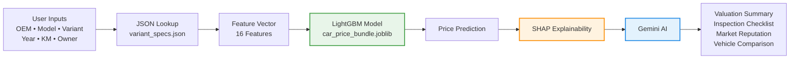

<h1 align="center">CARS67 | Cars 6x4/7</h1>
<h3 align="center">End-to-End Used Car Valuation Platform featuring LightGBM, Intelligent JSON Lookup, SHAP Explainability, and Gemini AI Insights</h3>
<br>


<div align="center">
  <a href="https://cars67.streamlit.app/">
    
  </a>
</div>

<br>

**Overview:** CARS67 is an end-to-end machine learning platform for intelligent used car valuation. The system combines a LightGBM regression model with automated JSON-based feature reconstruction, SHAP explainability, and Google's Gemini API to deliver accurate price predictions alongside AI-generated market insights.

Rather than requiring users to manually enter dozens of vehicle specifications, the platform reconstructs manufacturer specifications from only **OEM, Model, Variant, and Manufacturing Year**, reducing the prediction workflow to six user inputs while maintaining nearly identical predictive performance.

<div align="center">


</div>

<br>

## Core Capabilities

| Architecture & Features | Technical Implementation |
| :--- | :--- |
| **LightGBM Prediction Engine** | Ensemble regression model trained on 37,000+ used car listings to estimate fair market value with high accuracy and strong generalization. |
| **Intelligent JSON Lookup** | Automatically reconstructs 13 static manufacturer specifications from only OEM, Model, Variant, and Manufacturing Year, reducing manual user input without significant loss in prediction accuracy. |
| **Explainable AI Pipeline** | SHAP TreeExplainer identifies feature contributions, enabling transparent and interpretable predictions for every valuation. |
| **Gemini AI Integration** | Generates valuation summaries, vehicle reputation analysis, inspection checklists, and side-by-side vehicle comparison reports while remaining completely independent of the prediction engine. |
| **Production Deployment** | End-to-end Streamlit application with serialized model bundle, dynamic vehicle selection, real-time inference, and modular architecture. |

---

## Model Performance

The final LightGBM model was evaluated using <b>5-Fold Cross Validation</b> and achieved the following performance.

### Overall Metrics

| Metric | Value | Segment-wise MAPE | Value |
|--------|------:|-------------------|------:|
| Test MAE | ₹85,284 | < ₹5L | 19.44% |
| Test R² | 0.9512 | ₹5L–₹10L | 11.26% |
| Test MAPE | 14.93% | ₹10L–₹15L | 10.80% |
| Median APE | 10.55% | ₹15L–₹20L | 10.22% |
| | | > ₹20L | 10.86% |


## System Architecture



---

## Tech Stack

| Category | Technologies |
| :--- | :--- |
| **Machine Learning** | LightGBM, SHAP |
| **Backend** | Python |
| **Frontend** | Streamlit |
| **Data Processing** | Pandas, NumPy |
| **Model Serialization** | Joblib |
| **Generative AI** | Google Gemini API |
| **Deployment Assets** | JSON Lookup, Joblib Bundle |

---

## Project Structure

```text
CARS67/

├── app.py
├── requirements.txt
│
├── data/
│   ├── car_price_bundle.joblib
│   └── variant_specs.json
│
├── modules/
│   ├── ai.py
│   ├── data_utils.py
│   ├── ml.py
│   └── ui_utils.py
│
└── .streamlit/
```

---

## Quick Start

### 1. Clone the Repository

```bash
git clone https://github.com/PranayBothra/CARS67.git
cd CARS67
```

### 2. Install Dependencies

```bash
pip install -r requirements.txt
```

### 3. Configure API Key

Create:

```text
.streamlit/secrets.toml
```

```toml
GEMINI_API_KEY="YOUR_API_KEY"
```

### 4. Launch the Application

```bash
streamlit run app.py
```

---

## Key Highlights

- **37,800+** used car listings
- **140 → 16** engineered features
- **LightGBM** regression model
- **Automated JSON feature reconstruction**
- **SHAP explainability**
- **Gemini-powered AI insights**
- **Production-ready Streamlit deployment**
